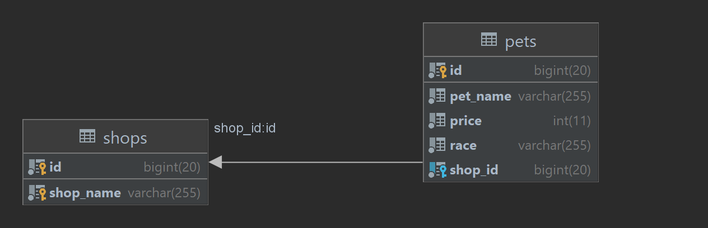

# Vizsgaremek

## Leírás

Jelen vizsgaremek témáját azért választottam, mert mindig szerettem az állatokat, kiskoromban macskáink voltak, most pedig egy kiskutyám, akivel sajnos már jó ideje nem találkoztam. Egy állatkereskedéseket kezelő alkalmazás funkcióit valósítja meg a teljesség igénye nélkül, mint például új bolt, eladó kisállat elvétele, listázása, ár módosítás, bolt törlése, kisállat eladása.

---

## Felépítés

### Entitás 1

A `Shop` entitás a következő attribútumokkal rendelkezik:

* `id`
* `name`     a kisállatkereskedés neve, nem lehet null vagy üres
* `pets`     az eladó állatok listája

Vágpontok:

| HTTP metódus | Végpont                                         | Leírás                                       |
| ------------ | ----------------------------------------------- |----------------------------------------------|
| GET          | `"/api/petshops/shops"`                         | lekérdezi az összes állatkereskedést         |
| GET          | `"/api/petshops/shops/{id}"`                    | lekérdez egy állatkereskedést `id` alapján   |
| POST         | `"/api/petshops/"`                              | új állatkereskedés létrehozása               |
| POST         | `"/api/petshops/shops/{id}/pets"`               | eladó állat felvétele egy állatkereskedéshez |
| DELETE       | `"/api/petshops/shops/{id}"`                    | kisállatkereskedés törlése                   |
| DELETE       | `"/api/petshops/shops/{shop-id}/pets/{pet-id}"` | egy állat eladása egy kisállatkereskedésből  |

---

### Entitás 2

A `PET` entitás a következő attribútumokkal rendelkezik:

* `id`
* `name`     az állat neve, nem lehet null vagy üres
* `race`     az eladó állat fajtája, nem lehet null
* `price`    az állat eladási ára, csak pozitív vagy nulla lehet
* `shop`     az állatot eladásra kínáló bolt azonosítója

A `Shop` és a `Pet` entitások között kétirányú, kétirányú 1-n kapcsolat van.

Végpontok:

| HTTP metódus | Végpont                      | Leírás                                              |
| ------------ | ---------------------------- |-----------------------------------------------------|
| GET          | `"/api/petshops/pets"`       | az állatok listázása                                |
| GET          | `"/api/petshops/pets{id}"`   | lekérdez egy kisállatot `id` alapján                |
| PUT          | `"/api/petshops/pets{id}"`   | egy eladó állat árának megváltoztatása `id` alapján |

Az állatok listázása opcionálisan szürhető fajra és árra is. 

---

## Technológiai részletek

A program egy JAVA nyelven írt, 3 rétegű alklamazás, repository, service, controller rétegekkel. Az adattároláshoz MariaDB adatbázist, az adatbázis létrehozásához pedig Flyway-t használ, az adatbáziskezelést pedig Spring Data JPA-val valósítja meg. Az alkalmazás RESTful szolgáltatások segítségével HTTP kéréseket szolgál ki. A beérkező adatok validálása spring-boot-starter-validation-nal, a hibakezelés pedig problem-spring-web-starter-el lett megoldva. Az integrált teszteléshez pedig WebClient-et használtam. Az alkalmazás kipróbálható http fájl, postman segítségével, illetve Swagger felület is biztosított.

---
